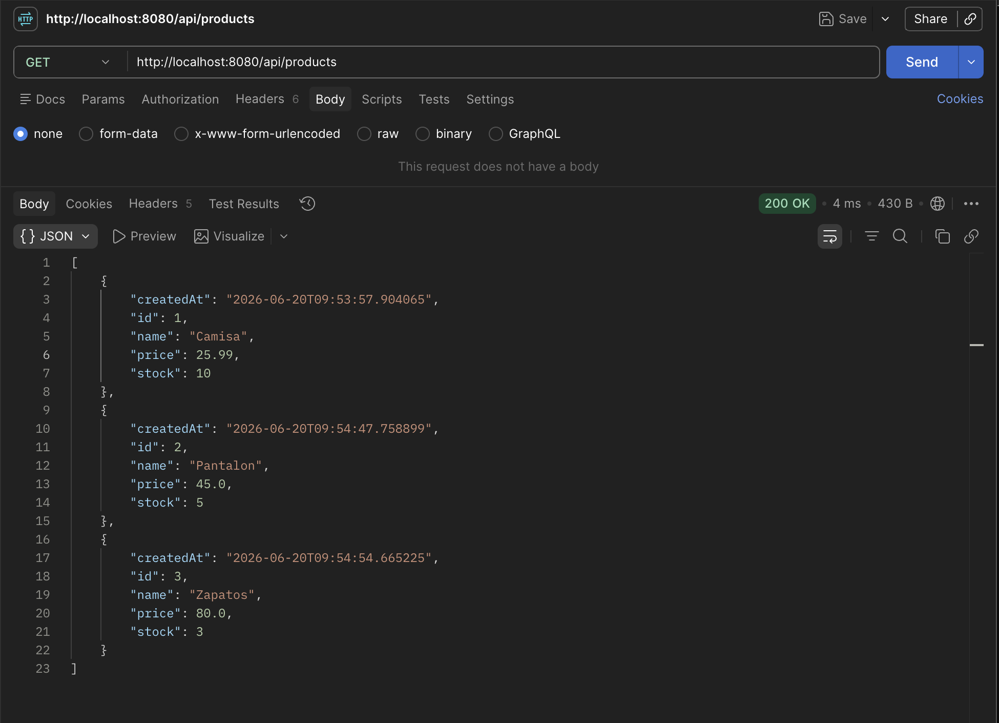
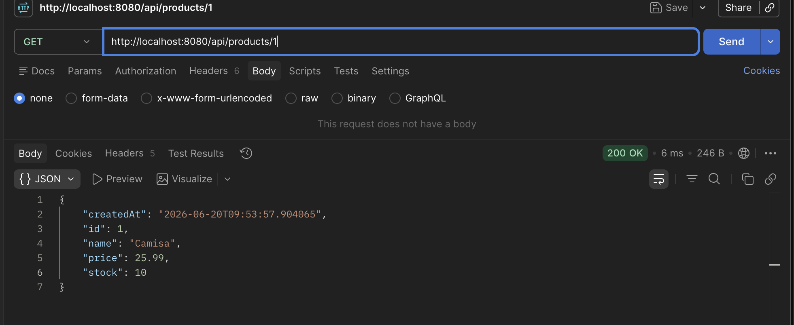
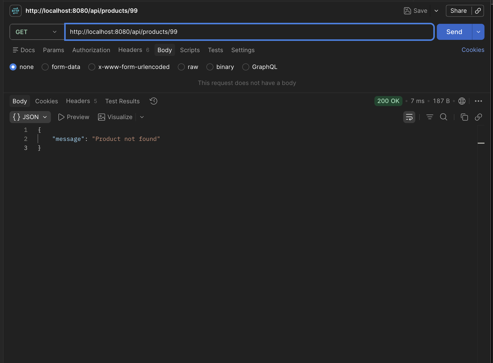
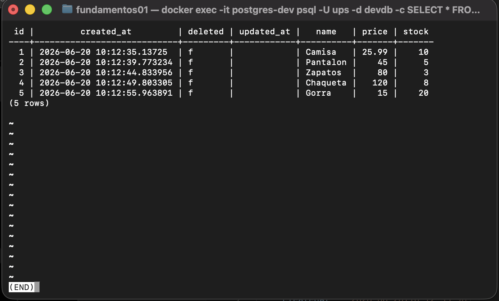

# Programación y Plataformas Web
## Frameworks Backend: Spring Boot – Prácticas 1, 2 y 5

**Estudiante:** Erick Paucar  
**Correo:** alexpaucar.887@gmail.com  
**Universidad Politécnica Salesiana – Cuenca**  
**Fecha:** 20/06/2026

---

# Práctica 1 y 2 – CRUD REST en memoria

## 1. Verificación del entorno

```bash
java -version
```


---

## 2. Ejecución del servidor

```bash
./gradlew bootRun
```


Spring Boot inició con Tomcat embebido en el puerto **8080** con context path `/api`.

---

## 3. Endpoint `/api/status`


```json
{
  "service": "Spring Boot API",
  "status": "running",
  "timestamp": "2026-06-20T14:53:57.904065"
}
```

---

## 4. Endpoints de Products en Postman

### GET /api/products — 3 productos creados


### GET /api/products/:id — producto existente


### DELETE /api/products/:id — producto que no existe


---

## 5. Explicación de anotaciones

| Anotación | Función |
|---|---|
| `@RestController` | Controlador REST que retorna JSON directamente |
| `@RequestMapping` | Define el prefijo de ruta de la clase |
| `@GetMapping` | Maneja peticiones HTTP GET |
| `@PostMapping` | Maneja peticiones HTTP POST |
| `@PutMapping` | Maneja peticiones HTTP PUT |
| `@PatchMapping` | Maneja peticiones HTTP PATCH |
| `@DeleteMapping` | Maneja peticiones HTTP DELETE |
| `@PathVariable` | Extrae un valor de la URL |
| `@RequestBody` | Convierte el JSON del body al DTO |
| `@Service` | Marca la clase como servicio inyectable |

---

# Práctica 5 – Persistencia real con PostgreSQL y JPA

## 6. Introducción

En las prácticas anteriores los datos se almacenaban en memoria con una lista:

```java
private List<UserModel> users = new ArrayList<>();
private Long currentId = 1L;
```

Esto tiene una limitación importante: **los datos se pierden al reiniciar la aplicación**.

En esta práctica se reemplaza la lista por una base de datos real usando:
- **PostgreSQL** — motor de base de datos
- **Spring Data JPA** — capa de abstracción para persistencia
- **Hibernate** — implementación de JPA
- **Docker** — contenedor para levantar PostgreSQL

---

## 7. Flujo de datos con repositorios

```
Cliente
  ↓
Controller
  ↓
Service
  ↓
ServiceImpl
  ↓
Repository
  ↓
PostgreSQL
  ↓
Entity → Mapper → Model → ResponseDto
  ↓
Cliente
```

| Clase | Responsabilidad |
|---|---|
| `Controller` | Recibe peticiones HTTP |
| `Service` | Define las operaciones disponibles |
| `ServiceImpl` | Implementa la lógica usando el repositorio |
| `Repository` | Ejecuta operaciones de persistencia |
| `Entity` | Representa la tabla en PostgreSQL |
| `Model` | Representa el objeto en la lógica de negocio |
| `Mapper` | Convierte entre DTOs, modelos y entidades |

---

## 8. Configuración

### 8.1 Dependencias en `build.gradle`

```gradle
implementation 'org.springframework.boot:spring-boot-starter-data-jpa'
runtimeOnly 'org.postgresql:postgresql'
```

### 8.2 `application.yml`

```yaml
server:
  port: 8080
  servlet:
    context-path: /api

spring:
  application:
    name: fundamentos01
  datasource:
    url: jdbc:postgresql://localhost:5432/devdb
    username: ups
    password: ups123
  jpa:
    hibernate:
      ddl-auto: update
    properties:
      hibernate:
        format_sql: true
        dialect: org.hibernate.dialect.PostgreSQLDialect
```

`ddl-auto: update` permite que Hibernate cree o actualice las tablas automáticamente sin eliminar datos existentes.

### 8.3 PostgreSQL con Docker

```bash
docker run --name postgres-dev \
  -e POSTGRES_USER=ups \
  -e POSTGRES_PASSWORD=ups123 \
  -e POSTGRES_DB=devdb \
  -p 5432:5432 \
  -d postgres
```

| Parámetro | Valor |
|---|---|
| Host | localhost |
| Puerto | 5432 |
| Usuario | ups |
| Contraseña | ups123 |
| Base de datos | devdb |

---

## 9. BaseEntity — Superclase de auditoría

```java
@MappedSuperclass
public abstract class BaseEntity {

    @Id
    @GeneratedValue(strategy = GenerationType.IDENTITY)
    private Long id;

    private LocalDateTime createdAt;
    private LocalDateTime updatedAt;
    private boolean deleted;

    @PrePersist
    protected void onCreate() {
        this.deleted = false;
        this.createdAt = LocalDateTime.now();
    }

    @PreUpdate
    protected void onUpdate() {
        this.updatedAt = LocalDateTime.now();
    }
}
```

| Anotación | Función |
|---|---|
| `@MappedSuperclass` | Los atributos se heredan a las entidades hijas sin crear tabla propia |
| `@Id` | Marca el identificador principal |
| `@GeneratedValue` | El ID lo genera automáticamente la base de datos |
| `@PrePersist` | Ejecuta lógica antes de insertar un registro |
| `@PreUpdate` | Ejecuta lógica antes de actualizar un registro |

Todas las entidades extienden `BaseEntity`, por lo que heredan automáticamente `id`, `createdAt`, `updatedAt` y `deleted`.

---

## 10. ProductEntity

```java
@Entity
@Table(name = "products")
public class ProductEntity extends BaseEntity {

    @Column(nullable = false, length = 150)
    private String name;

    @Column(nullable = false)
    private Double price;

    @Column(nullable = false)
    private Integer stock;
}
```

| Anotación | Función |
|---|---|
| `@Entity` | Indica que la clase representa una tabla |
| `@Table` | Define el nombre de la tabla en la BD |
| `@Column` | Configura propiedades de la columna |

---

## 11. ProductRepository

```java
@Repository
public interface ProductRepository extends JpaRepository<ProductEntity, Long> {}
```

`JpaRepository<ProductEntity, Long>` provee automáticamente:

```java
save(entity)       // insertar o actualizar
findById(id)       // buscar por ID
findAll()          // listar todos
deleteById(id)     // eliminar por ID
existsById(id)     // verificar si existe
```

Ya no se necesita lista en memoria ni `currentId` — el repositorio y PostgreSQL manejan todo.

---

## 12. Eliminación lógica (soft delete)

En lugar de eliminar físicamente el registro, se marca como eliminado:

```java
@Override
public void delete(Long id) {
    ProductEntity entity = productRepository.findById(id)
            .orElseThrow(() -> new IllegalStateException("Product not found"));
    entity.setDeleted(true);   // ← marca como eliminado
    productRepository.save(entity);  // ← guarda el cambio
}
```

El registro permanece en la base de datos con `deleted = true`, lo que permite auditoría y recuperación futura.

---

## 13. Flujo de datos — ejemplo de create

```
POST /api/products
  ↓
CreateProductDto (name, price, stock)
  ↓
ProductMapper.toModelFromDTO() → ProductModel
  ↓
ProductMapper.toEntityFromModel() → ProductEntity
  ↓
productRepository.save() → PostgreSQL
  ↓
ProductMapper.toModelFromEntity() → ProductModel
  ↓
ProductMapper.toResponse() → ProductResponseDto
  ↓
Respuesta JSON al cliente
```

---

## 14. Verificación en PostgreSQL — 5 productos creados

Consulta ejecutada:

```sql
SELECT * FROM products;
```



Los 5 productos fueron creados mediante la API REST y persistidos correctamente en PostgreSQL. Se observa:
- **ID auto-generado** por `@GeneratedValue` — no lo envía el cliente
- **`created_at`** registrado automáticamente por `@PrePersist`
- **`deleted = f`** (false) — ningún producto eliminado físicamente
- **`updated_at`** vacío hasta que se realice una actualización

---

## 15. Comparación: memoria vs PostgreSQL

| Aspecto | Lista en memoria | PostgreSQL + JPA |
|---|---|---|
| Persistencia | Se pierde al reiniciar | Permanente |
| ID | Manual (`currentId++`) | Auto-generado (`@GeneratedValue`) |
| Escalabilidad | Limitada a RAM | Ilimitada |
| Auditoría | No | Sí (`createdAt`, `updatedAt`) |
| Eliminación | Física | Lógica (`deleted = true`) |
| Búsquedas | Manual con stream | Automática con JPA |

---

## 16. Conclusión

Spring Boot con JPA y PostgreSQL permite construir una API REST con persistencia real de forma organizada. La arquitectura en capas (Controller → Service → Repository → Entity) separa claramente las responsabilidades. `BaseEntity` centraliza los campos de auditoría compartidos. El uso de Mappers evita exponer la estructura interna de la base de datos al cliente. La eliminación lógica preserva el historial de datos sin eliminar registros físicamente.