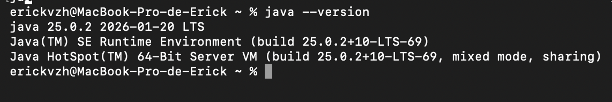
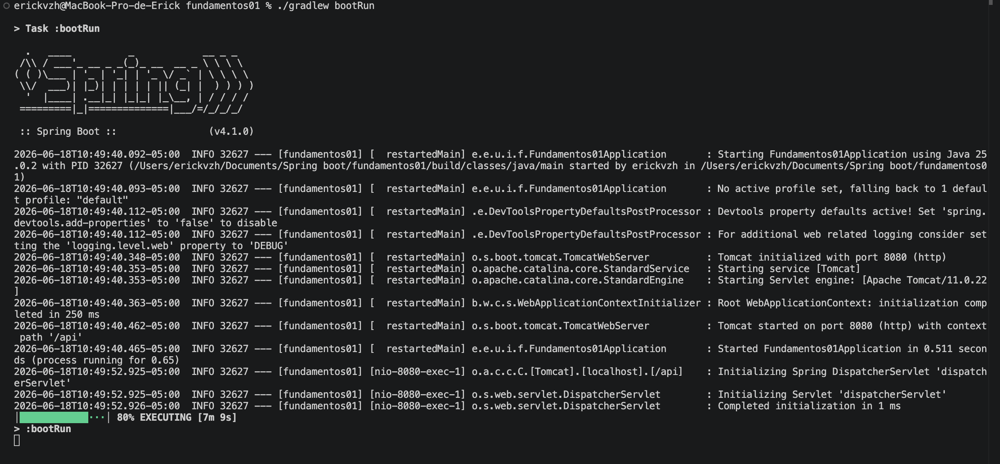
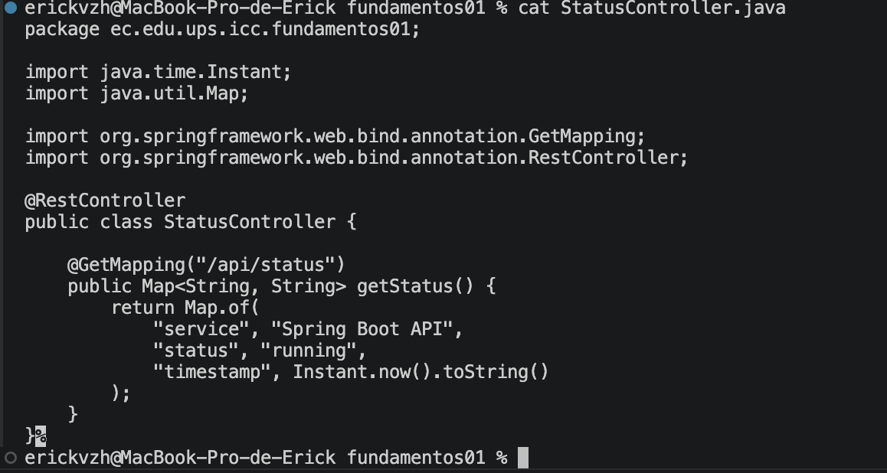
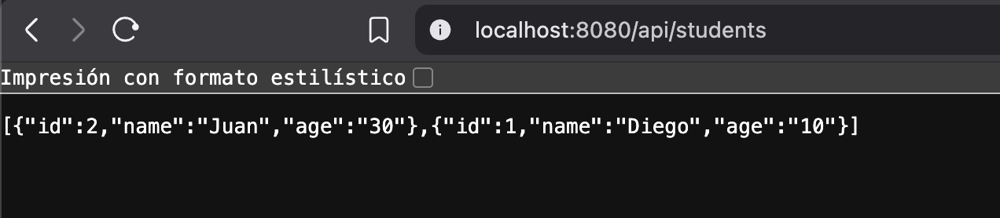
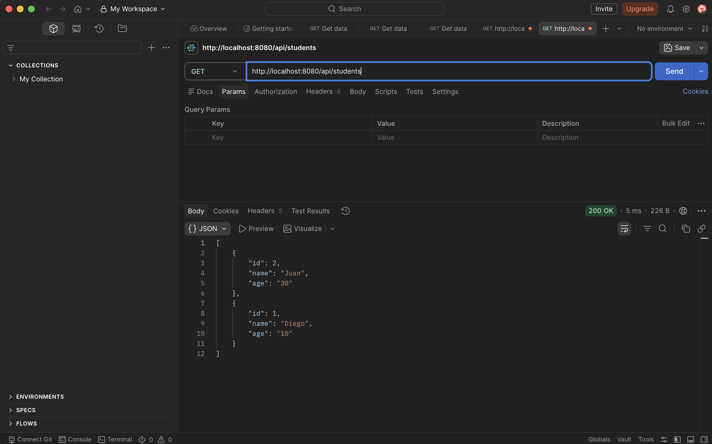
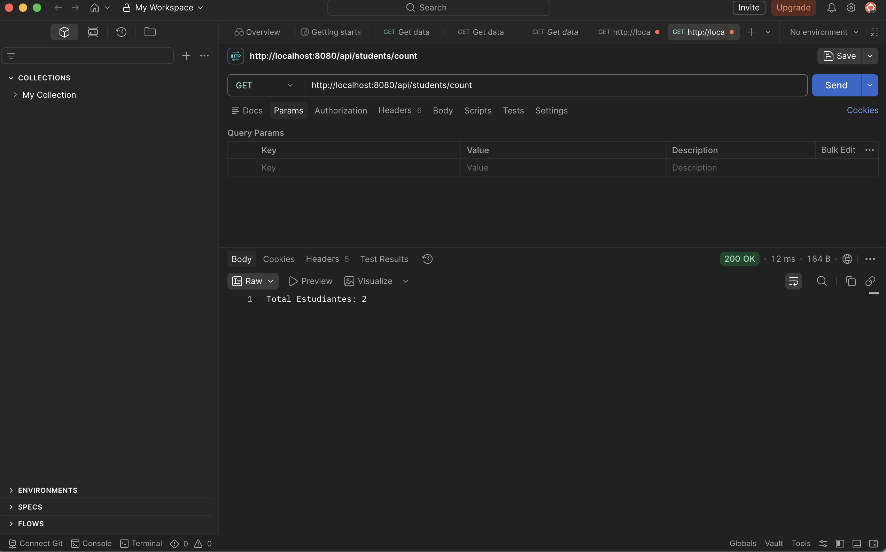

# Programación y Plataformas Web
## Frameworks Backend: Spring Boot – Práctica 1

**Estudiante:** Erick Paucar  
**Correo:** alexpaucar.887@gmail.com  
**Universidad Politécnica Salesiana – Cuenca**  
**Fecha:** 18/06/2026

---

# 1. Introducción

Spring Boot es un framework backend para Java que simplifica la creación de aplicaciones empresariales mediante configuración automática, servidor embebido y dependencias predefinidas. Forma parte del ecosistema Spring y permite construir APIs REST de forma rápida, organizada y escalable sin necesidad de configurar manualmente un servidor externo.

En esta práctica se instaló el entorno, se ejecutó el servidor y se implementaron los primeros endpoints REST.

---

# 2. Verificación del entorno

## 2.1 Versión de Java

Comando ejecutado:
```bash
java -version
```

**Captura:**



Se verificó una versión compatible de Java (v25.0.2 LTS). Spring Boot requiere como mínimo Java 17.

---

## 2.2 Estructura del proyecto

El proyecto fue generado con Spring Initializr usando Gradle como gestor de dependencias. La estructura generada es:

```
src/
  └── main/
       └── java/ec/edu/ups/icc/fundamentos01/
            ├── Fundamentos01Application.java   ← Punto de entrada
            ├── StatusController.java            ← Controlador de estado
            └── students/
                 ├── controllers/
                 │    └── StudentController.java
                 └── models/
                      └── Student.java
```

| Archivo | Función |
|---|---|
| `Fundamentos01Application.java` | Clase principal que arranca la aplicación |
| `StatusController.java` | Endpoint de verificación del servidor |
| `StudentController.java` | Endpoints del dominio estudiantes |
| `Student.java` | Modelo de datos del estudiante |
| `build.gradle` | Dependencias del proyecto |
| `gradlew` | Script para ejecutar Gradle sin instalación global |

---

# 3. Ejecución del servidor

Comando utilizado:
```bash
./gradlew bootRun
```

**Captura:**



Spring Boot inició correctamente con Tomcat embebido en el puerto **8080**. No se requiere instalar ni configurar un servidor externo — Spring Boot lo incluye automáticamente.

---

# 4. Endpoints implementados

## 4.1 Endpoint `/api/status`

**Captura del controlador:**



Código implementado en `StatusController.java`:

```java
@RestController
@RequestMapping("/api/status")
public class StatusController {

    @GetMapping
    public Map<String, String> getStatus() {
        return Map.of(
            "service", "Spring Boot API",
            "status", "running",
            "timestamp", Instant.now().toString()
        );
    }
}
```

**Captura del endpoint funcionando:**



Respuesta JSON en `http://localhost:8080/api/status`:
```json
{
  "service": "Spring Boot API",
  "status": "running",
  "timestamp": "2026-06-18T23:14:00.000Z"
}
```

---

## 4.2 Endpoint `/api/students`

Código implementado en `StudentController.java`:

```java
@RestController
@RequestMapping("/api/students")
public class StudentController {

    private List<Student> students = new ArrayList<>();

    public StudentController() {
        students.add(new Student(id: 2, name: "Juan", age: "30"));
        students.add(new Student(id: 1, name: "Diego", age: "10"));
    }

    @GetMapping
    public List<Student> getStudents() {
        return students;
    }

    @GetMapping("/count")
    public String getCount() {
        return "Total Estudiantes: " + students.size();
    }
}
```

**Captura del endpoint `/api/students` en Postman:**

<!-- INSERTAR CAPTURA: Postman mostrando 200 OK con la lista de Juan y Diego -->



Respuesta JSON en `http://localhost:8080/api/students`:
```json
[
  { "id": 2, "name": "Juan", "age": "30" },
  { "id": 1, "name": "Diego", "age": "10" }
]
```

**Captura del endpoint `/api/students/count`:**

<!-- INSERTAR CAPTURA: Postman mostrando "Total Estudiantes: 2" -->



---

# 5. Explicación de anotaciones

### `@RestController`
Indica que la clase es un controlador REST. Combina `@Controller` y `@ResponseBody`, lo que significa que todos los métodos retornan directamente datos JSON en lugar de vistas HTML.

### `@RequestMapping`
Define el prefijo de ruta para todos los endpoints de la clase. Por ejemplo, `@RequestMapping("/api/students")` hace que todos los métodos respondan bajo esa ruta base.

### `@GetMapping`
Mapea un método al método HTTP GET. Se puede combinar con una ruta adicional como `@GetMapping("/count")` para crear sub-rutas.

### `@SpringBootApplication`
Anotación principal que activa la configuración automática, el escaneo de componentes y la configuración de Spring Boot en la clase principal.

---

# 6. Comparación con NestJS

Ambos frameworks implementan el mismo patrón de arquitectura pero en lenguajes diferentes:

| Concepto | Spring Boot (Java) | NestJS (TypeScript) |
|---|---|---|
| Controlador | `@RestController` | `@Controller()` |
| Ruta base | `@RequestMapping("/ruta")` | `@Controller('ruta')` |
| Método GET | `@GetMapping` | `@Get()` |
| Servicio | `@Service` | `@Injectable()` |
| Módulo | `@SpringBootApplication` | `@Module()` |
| Puerto por defecto | 8080 | 3000 |
| Servidor embebido | Tomcat | Express |

La principal diferencia es el lenguaje y el sistema de módulos: NestJS organiza explícitamente módulos, controladores y servicios por dominio, mientras que Spring Boot usa el escaneo automático de componentes a partir del paquete raíz.

---

# 7. Conclusión

Spring Boot permite crear APIs REST de forma rápida gracias a su configuración automática y servidor Tomcat embebido. Las anotaciones como `@RestController`, `@GetMapping` y `@RequestMapping` definen el comportamiento de cada componente de manera clara y expresiva, de forma similar a los decoradores de NestJS. La arquitectura por dominios (separando controladores y modelos en carpetas propias) facilita la mantenibilidad y escalabilidad del proyecto.