# Prácticas 14, 15 y 16 — Spring Boot

---

## Práctica 14 — Refresh Token con JWT

### Capturas

**Login con refresh token**
`POST /api/auth/login`
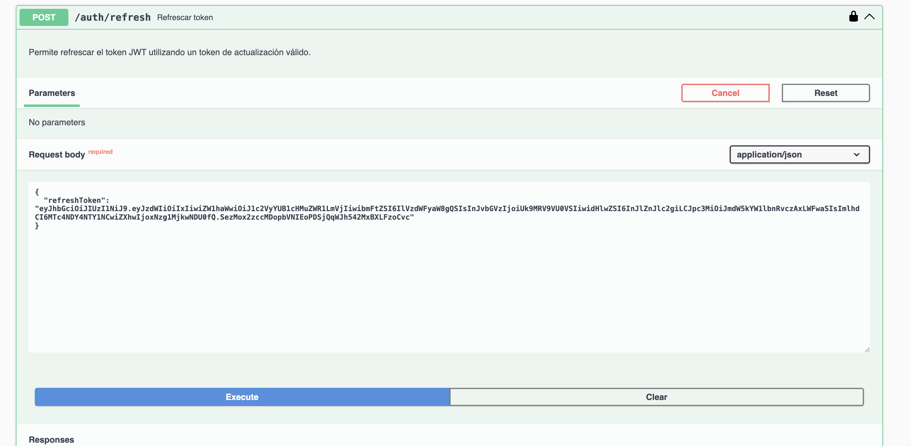

**Refresh exitoso**
`POST /api/auth/refresh`
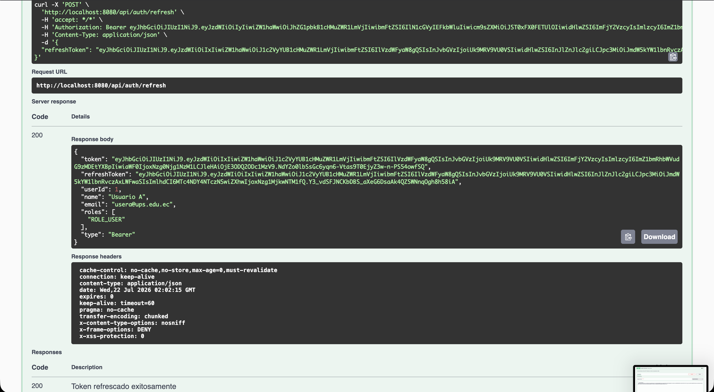

**Logout**
`POST /api/auth/logout`
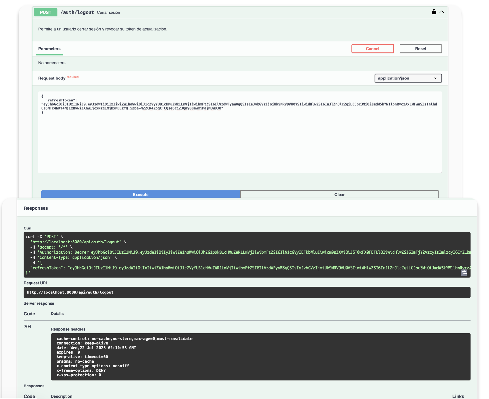

**Refresh después de logout**
`POST /api/auth/refresh`
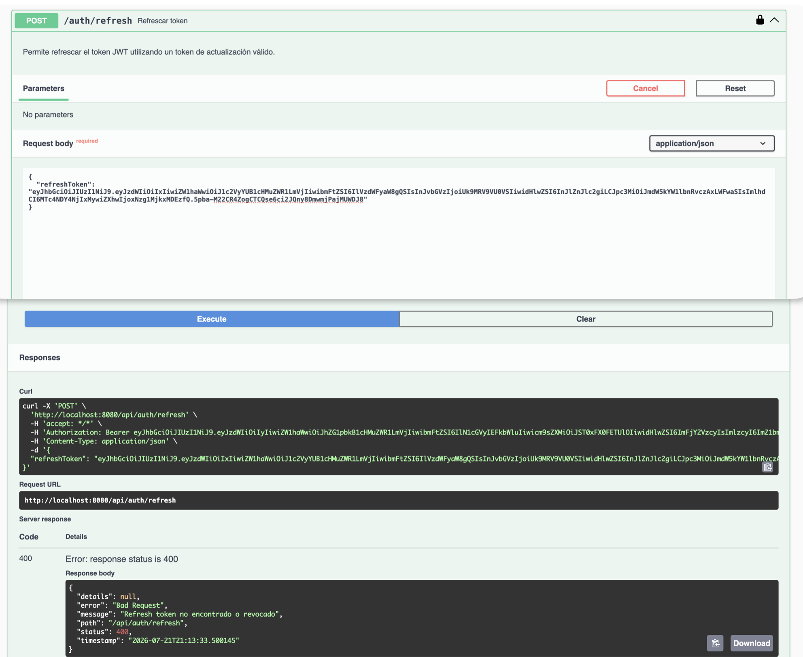

### Preguntas

**¿Cuál es la diferencia entre access token y refresh token?**
El access token dura 30 minutos y se usa en cada petición en el header `Authorization: Bearer`. El refresh token dura 7 días y sirve solo para renovar el access token en `/auth/refresh`.

**¿Por qué el refresh token no debe usarse en Authorization: Bearer?**
Porque el filtro JWT solo acepta tokens de tipo `access`. Usar el refresh token en el header expone innecesariamente un token de larga duración a todos los endpoints de la API.

**¿Qué significa rotar un refresh token?**
Cada vez que se usa el refresh token para renovar el access token, ese refresh token se revoca y se emite uno nuevo. Esto evita que un token comprometido sea reutilizado indefinidamente.

---

## Práctica 15 — Documentación con Swagger y OpenAPI

### Capturas

**Swagger UI cargado**
`/api/swagger-ui/index.html`
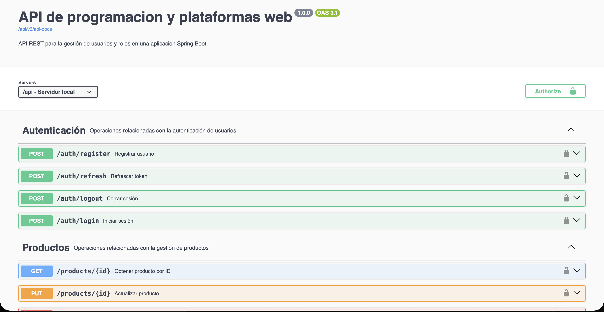

**JSON OpenAPI**
`/api/v3/api-docs`
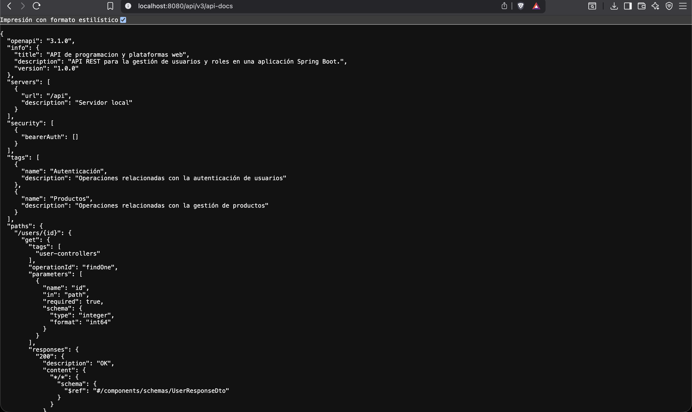

**AuthController documentado**
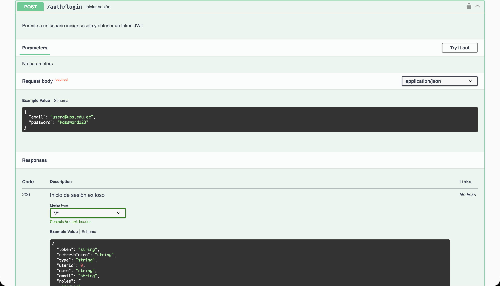

**Botón Authorize**
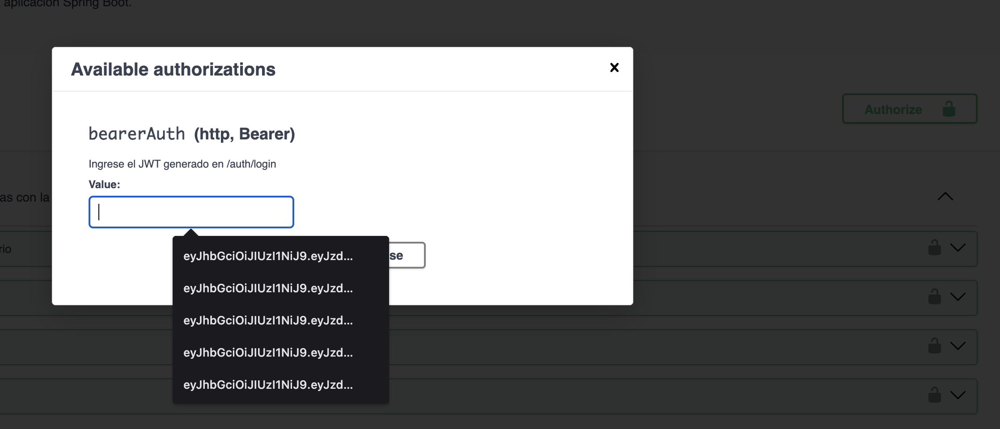

**Endpoint sin token — 401**
`GET /api/products/page?page=0&size=5`
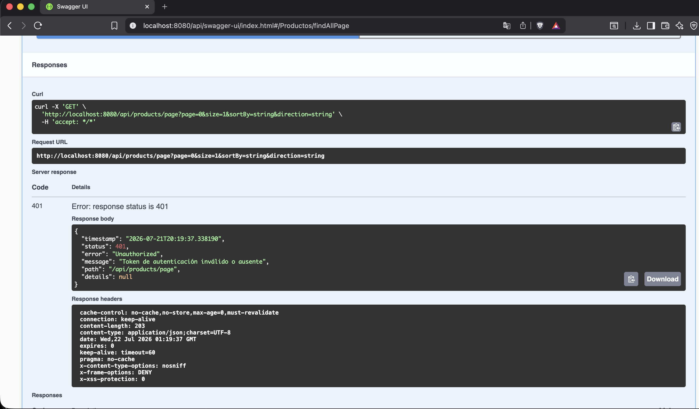

**Endpoint con token — 200**
`GET /api/products/page?page=0&size=5`

**ROLE_USER en endpoint ADMIN — 403**
`GET /api/products`
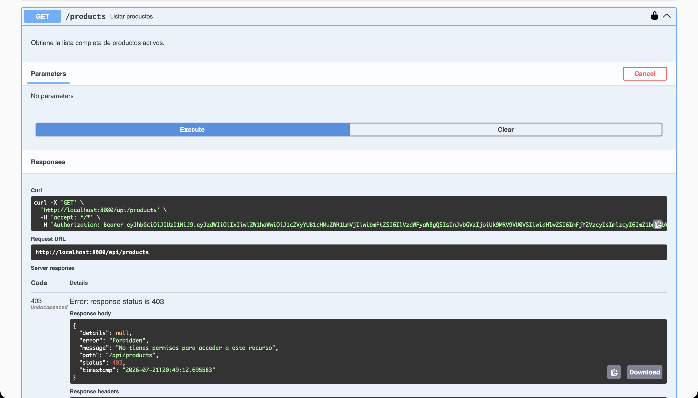

**ROLE_ADMIN en endpoint ADMIN — 200**
`GET /api/products`
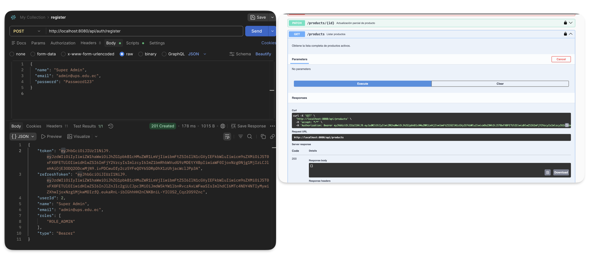

### Preguntas

**¿Cuál es la diferencia entre Swagger UI y OpenAPI?**
OpenAPI es la especificación en JSON/YAML que describe los endpoints, parámetros y respuestas de la API. Swagger UI es la interfaz visual que lee esa especificación y permite probar los endpoints desde el navegador.

**¿Por qué Swagger puede ser público pero los endpoints seguir protegidos?**
Swagger UI y `/v3/api-docs` son recursos de documentación que se permiten en `SecurityConfig` con `permitAll()`. Los endpoints de la API siguen protegidos con `.anyRequest().authenticated()` independientemente.

**¿Cómo se configura Swagger para enviar un JWT en Authorization: Bearer?**
Se define un `SecurityScheme` de tipo HTTP, esquema `bearer` y formato `JWT` en `OpenApiConfig`. Esto habilita el botón Authorize en Swagger UI donde se pega el token, y Swagger lo envía automáticamente en el header de cada petición.

---

## Práctica 16 — Despliegue con Docker en Kali Linux (UTM)

### Capturas

**docker ps en Kali**
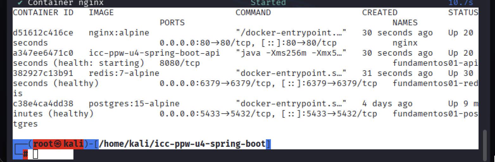

**curl desde Kali**
`curl http://localhost/api/status`
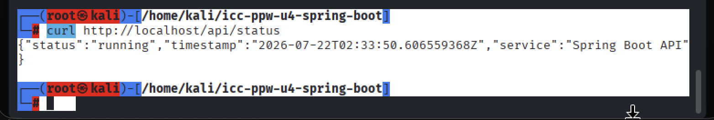

**curl desde Mac**
`curl http://192.168.64.2/api/status`
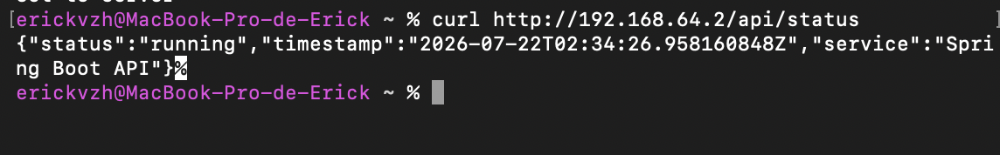

**Login desde Mac**
`POST http://192.168.64.2/api/auth/login`
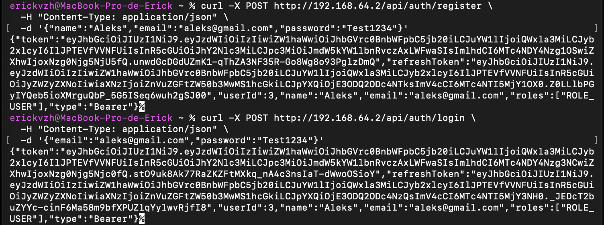

**GET /api/products/page con token desde Mac**
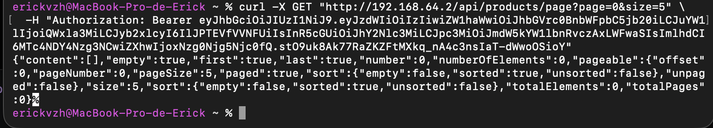

### Conexión a PostgreSQL

El contenedor `fundamentos01-api` corre en Kali (`192.168.64.2`) y se conecta a PostgreSQL en el Mac (`192.168.64.1:5432`) mediante la variable `DATABASE_URL=jdbc:postgresql://192.168.64.1:5432/devdb`. La red virtual de UTM (`192.168.64.0/24`) permite la comunicación entre ambas máquinas. Nginx expone el puerto 80 en Kali y redirige las peticiones al contenedor de Spring Boot en el puerto 8080.