# Programación y Plataformas Web
## Frameworks Backend: Spring Boot – Prácticas 1 a 13

**Estudiante:** Erick Paucar  
**Correo:** alexpaucar.887@gmail.com  
**Universidad Politécnica Salesiana – Cuenca**  
**Fecha:** 20/06/2026 – 10/07/2026

---

# Práctica 1 (introductoria) – Endpoint de Estudiantes en memoria

Antes de construir el CRUD de productos y usuarios se practicó con un controlador simple para fijar los conceptos base de Spring Boot: `@RestController`, `@RequestMapping`, `@GetMapping` y el retorno automático de JSON.

```java
@RestController
@RequestMapping("/students")
public class StudentController {
    private List<Student> students = new ArrayList<>();

    public StudentController() {
        students.add(new Student(2, "Juan", "30"));
        students.add(new Student(1, "Diego", "10"));
    }

    @GetMapping()
    public List<Student> getStudents() {
        return students;
    }

    @GetMapping("/count")
    public String getCount() {
        return "Total Estudiantes: " + students.size();
    }
}
```

### GET /api/students


### GET /api/students/count


---

# Práctica 1 y 2 – CRUD REST en memoria

## 1. Verificación del entorno

```bash
java -version
```


---

## 2. Ejecución del servidor

```bash
./gradlew bootRun
```


Spring Boot inició con Tomcat embebido en el puerto **8080** con context path `/api`.

---

## 3. Endpoint `/api/status`


```json
{
  "service": "Spring Boot API",
  "status": "running",
  "timestamp": "2026-06-20T14:53:57.904065"
}
```

---

## 4. Endpoints de Products en Postman

### GET /api/products — 3 productos creados


### GET /api/products/:id — producto existente


### DELETE /api/products/:id — producto que no existe


---

## 5. Explicación de anotaciones

| Anotación | Función |
|---|---|
| `@RestController` | Controlador REST que retorna JSON directamente |
| `@RequestMapping` | Define el prefijo de ruta de la clase |
| `@GetMapping` | Maneja peticiones HTTP GET |
| `@PostMapping` | Maneja peticiones HTTP POST |
| `@PutMapping` | Maneja peticiones HTTP PUT |
| `@PatchMapping` | Maneja peticiones HTTP PATCH |
| `@DeleteMapping` | Maneja peticiones HTTP DELETE |
| `@PathVariable` | Extrae un valor de la URL |
| `@RequestBody` | Convierte el JSON del body al DTO |
| `@Service` | Marca la clase como servicio inyectable |

---

# Práctica 5 – Persistencia real con PostgreSQL y JPA

## 6. Introducción

En las prácticas anteriores los datos se almacenaban en memoria con una lista:

```java
private List<UserModel> users = new ArrayList<>();
private Long currentId = 1L;
```

Esto tiene una limitación importante: **los datos se pierden al reiniciar la aplicación**.

En esta práctica se reemplaza la lista por una base de datos real usando:
- **PostgreSQL** — motor de base de datos
- **Spring Data JPA** — capa de abstracción para persistencia
- **Hibernate** — implementación de JPA
- **Docker** — contenedor para levantar PostgreSQL

---

## 7. Flujo de datos con repositorios

```
Cliente
  ↓
Controller
  ↓
Service
  ↓
ServiceImpl
  ↓
Repository
  ↓
PostgreSQL
  ↓
Entity → Mapper → Model → ResponseDto
  ↓
Cliente
```

| Clase | Responsabilidad |
|---|---|
| `Controller` | Recibe peticiones HTTP |
| `Service` | Define las operaciones disponibles |
| `ServiceImpl` | Implementa la lógica usando el repositorio |
| `Repository` | Ejecuta operaciones de persistencia |
| `Entity` | Representa la tabla en PostgreSQL |
| `Model` | Representa el objeto en la lógica de negocio |
| `Mapper` | Convierte entre DTOs, modelos y entidades |

---

## 8. Configuración

### 8.1 Dependencias en `build.gradle`

```gradle
implementation 'org.springframework.boot:spring-boot-starter-data-jpa'
runtimeOnly 'org.postgresql:postgresql'
```

### 8.2 `application.yml`

```yaml
server:
  port: 8080
  servlet:
    context-path: /api

spring:
  application:
    name: fundamentos01
  datasource:
    url: jdbc:postgresql://localhost:5432/devdb
    username: ups
    password: ups123
  jpa:
    hibernate:
      ddl-auto: update
    properties:
      hibernate:
        format_sql: true
        dialect: org.hibernate.dialect.PostgreSQLDialect
```

`ddl-auto: update` permite que Hibernate cree o actualice las tablas automáticamente sin eliminar datos existentes.

### 8.3 PostgreSQL con Docker

```bash
docker run --name postgres-dev \
  -e POSTGRES_USER=ups \
  -e POSTGRES_PASSWORD=ups123 \
  -e POSTGRES_DB=devdb \
  -p 5432:5432 \
  -d postgres
```

| Parámetro | Valor |
|---|---|
| Host | localhost |
| Puerto | 5432 |
| Usuario | ups |
| Contraseña | ups123 |
| Base de datos | devdb |

---

## 9. BaseEntity — Superclase de auditoría

```java
@MappedSuperclass
public abstract class BaseEntity {

    @Id
    @GeneratedValue(strategy = GenerationType.IDENTITY)
    private Long id;

    private LocalDateTime createdAt;
    private LocalDateTime updatedAt;
    private boolean deleted;

    @PrePersist
    protected void onCreate() {
        this.deleted = false;
        this.createdAt = LocalDateTime.now();
    }

    @PreUpdate
    protected void onUpdate() {
        this.updatedAt = LocalDateTime.now();
    }
}
```

| Anotación | Función |
|---|---|
| `@MappedSuperclass` | Los atributos se heredan a las entidades hijas sin crear tabla propia |
| `@Id` | Marca el identificador principal |
| `@GeneratedValue` | El ID lo genera automáticamente la base de datos |
| `@PrePersist` | Ejecuta lógica antes de insertar un registro |
| `@PreUpdate` | Ejecuta lógica antes de actualizar un registro |

Todas las entidades extienden `BaseEntity`, por lo que heredan automáticamente `id`, `createdAt`, `updatedAt` y `deleted`.

---

## 10. ProductEntity

```java
@Entity
@Table(name = "products")
public class ProductEntity extends BaseEntity {

    @Column(nullable = false, length = 150)
    private String name;

    @Column(nullable = false)
    private Double price;

    @Column(nullable = false)
    private Integer stock;
}
```

| Anotación | Función |
|---|---|
| `@Entity` | Indica que la clase representa una tabla |
| `@Table` | Define el nombre de la tabla en la BD |
| `@Column` | Configura propiedades de la columna |

---

## 11. ProductRepository

```java
@Repository
public interface ProductRepository extends JpaRepository<ProductEntity, Long> {}
```

`JpaRepository<ProductEntity, Long>` provee automáticamente:

```java
save(entity)       // insertar o actualizar
findById(id)       // buscar por ID
findAll()          // listar todos
deleteById(id)     // eliminar por ID
existsById(id)     // verificar si existe
```

Ya no se necesita lista en memoria ni `currentId` — el repositorio y PostgreSQL manejan todo.

---

## 12. Eliminación lógica (soft delete)

En lugar de eliminar físicamente el registro, se marca como eliminado:

```java
@Override
public void delete(Long id) {
    ProductEntity entity = productRepository.findById(id)
            .orElseThrow(() -> new IllegalStateException("Product not found"));
    entity.setDeleted(true);   // ← marca como eliminado
    productRepository.save(entity);  // ← guarda el cambio
}
```

El registro permanece en la base de datos con `deleted = true`, lo que permite auditoría y recuperación futura.

---

## 13. Flujo de datos — ejemplo de create

```
POST /api/products
  ↓
CreateProductDto (name, price, stock)
  ↓
ProductMapper.toModelFromDTO() → ProductModel
  ↓
ProductMapper.toEntityFromModel() → ProductEntity
  ↓
productRepository.save() → PostgreSQL
  ↓
ProductMapper.toModelFromEntity() → ProductModel
  ↓
ProductMapper.toResponse() → ProductResponseDto
  ↓
Respuesta JSON al cliente
```

---

## 14. Verificación en PostgreSQL — 5 productos creados

Consulta ejecutada:

```sql
SELECT * FROM products;
```


Los 5 productos fueron creados mediante la API REST y persistidos correctamente en PostgreSQL. Se observa:
- **ID auto-generado** por `@GeneratedValue` — no lo envía el cliente
- **`created_at`** registrado automáticamente por `@PrePersist`
- **`deleted = f`** (false) — ningún producto eliminado físicamente
- **`updated_at`** vacío hasta que se realice una actualización

---

## 15. Comparación: memoria vs PostgreSQL

| Aspecto | Lista en memoria | PostgreSQL + JPA |
|---|---|---|
| Persistencia | Se pierde al reiniciar | Permanente |
| ID | Manual (`currentId++`) | Auto-generado (`@GeneratedValue`) |
| Escalabilidad | Limitada a RAM | Ilimitada |
| Auditoría | No | Sí (`createdAt`, `updatedAt`) |
| Eliminación | Física | Lógica (`deleted = true`) |
| Búsquedas | Manual con stream | Automática con JPA |

---

## 16. Conclusión

Spring Boot con JPA y PostgreSQL permite construir una API REST con persistencia real de forma organizada. La arquitectura en capas (Controller → Service → Repository → Entity) separa claramente las responsabilidades. `BaseEntity` centraliza los campos de auditoría compartidos. El uso de Mappers evita exponer la estructura interna de la base de datos al cliente. La eliminación lógica preserva el historial de datos sin eliminar registros físicamente.

---

# Práctica 6 – Validaciones con Bean Validation

## 17. Reemplazo de validaciones manuales por anotaciones

Antes de esta práctica, cualquier validación (nombre vacío, precio negativo, etc.) se escribía a mano dentro del `Service`. Se incorporó la dependencia `spring-boot-starter-validation` y los DTOs de entrada (`CreateProductDto`, `UpdateProductDto`, `PartialUpdateProductDto`, `CreateUserDto`, `UpdateUserDto`, `PartialUpdateUserDto`) se anotaron con `jakarta.validation.constraints`:

```java
public class CreateProductDto {
    @NotBlank(message = "El nombre es obligatorio")
    @Size(min = 3, max = 150, message = "El nombre debe tener entre 3 y 150 caracteres")
    private String name;

    @NotNull(message = "El precio es obligatorio")
    @DecimalMin(value = "0.0", message = "El precio no puede ser negativo")
    private Double price;

    @NotNull(message = "El stock es obligatorio")
    @Min(value = 0, message = "El stock no puede ser negativo")
    private Integer stock;
}
```

| Anotación | Función |
|---|---|
| `@NotBlank` | El campo no puede ser nulo ni estar vacío/solo espacios |
| `@NotNull` | El campo no puede ser nulo |
| `@NotEmpty` | La colección no puede ser nula ni vacía |
| `@Size(min, max)` | Longitud permitida de un `String` |
| `@Min` / `@Max` | Rango permitido de un número entero |
| `@DecimalMin` | Valor mínimo permitido de un número decimal |

En los controladores, el parámetro del DTO se marca con `@Valid` para que Spring ejecute las validaciones **antes** de invocar al `Service`:

```java
@PostMapping
public ProductResponseDto create(@Valid @RequestBody CreateProductDto dto, ...) { ... }
```

Si una validación falla, Spring lanza `MethodArgumentNotValidException`, que se maneja de forma centralizada (ver Práctica 9).

---

# Práctica 7 – Cliente REST Bruno y pruebas de validación

## 18. Bruno como cliente REST versionable

Se migraron las pruebas manuales a [Bruno](https://www.usebruno.com/), un cliente REST cuyas colecciones se guardan como archivos `.bru` dentro del repositorio (carpeta `bruno/`), organizados en `Categories`, `Product` y `User`. Esto permite versionar las peticiones junto con el código en lugar de depender de una colección exportada de Postman.

Con la colección lista se probaron los límites de las validaciones agregadas en la Práctica 6.

### Nombre de producto demasiado corto (`"name": "A"`)


`400 Bad Request` — *"El nombre debe tener entre 3 y 150 caracteres"*.

### Producto inválido (nombre vacío, precio y stock negativos)


`400 Bad Request` con los 4 errores simultáneos que reporta `MethodArgumentNotValidException`: nombre obligatorio, tamaño de nombre inválido, precio negativo y stock negativo.

### Usuario inválido (nombre vacío, email mal formado, contraseña corta)


### Producto válido


`200/201` — el producto se crea y persiste correctamente cuando todos los campos cumplen las validaciones.

---

# Práctica 8 – Relaciones entre entidades (Owner y Category)

## 19. De IDs sueltos a relaciones JPA reales

`ProductEntity` dejó de ser independiente y pasó a relacionarse con `UserEntity` (dueño del producto) y `CategoryEntity` (categoría) mediante `@ManyToOne`:

```java
@ManyToOne(optional = false, fetch = FetchType.LAZY)
@JoinColumn(name = "user_id", nullable = false)
private UserEntity owner;

@ManyToOne(optional = false, fetch = FetchType.LAZY)
@JoinColumn(name = "category_id", nullable = false)
private CategoryEntity category;
```

El DTO de creación pasó a pedir `userId` y `categoryId`, y se agregaron endpoints para navegar la relación desde el otro lado:

- `GET /api/products/user/{id}` — productos de un usuario
- `GET /api/products/category/{id}` — productos de una categoría

### Productos de un usuario — `GET /api/products/user/1`
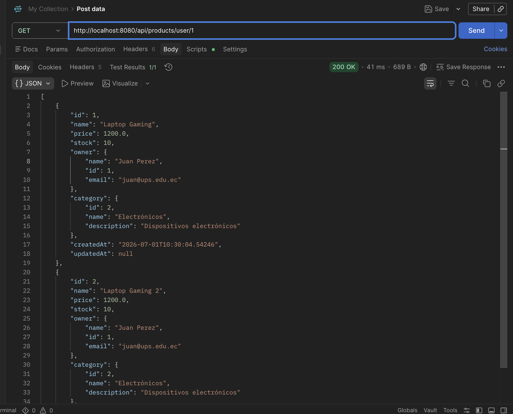

### Productos de una categoría — `GET /api/products/category/2`
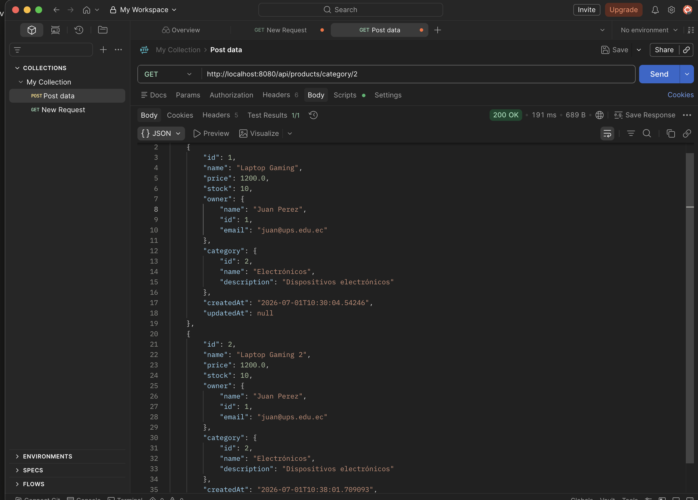

### Creación de un producto indicando `userId` y `categoryId`
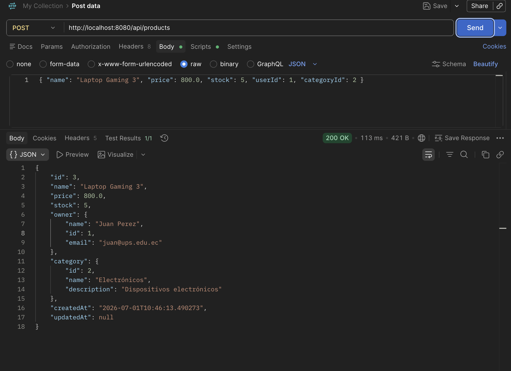

### Verificación de las llaves foráneas en PostgreSQL
```sql
\d products
```
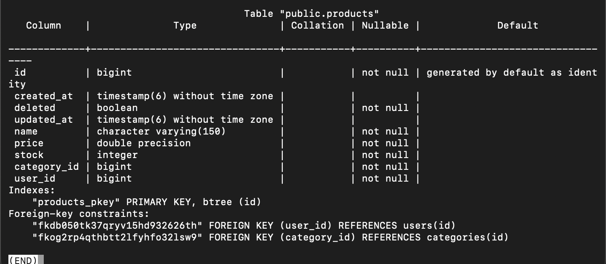

La tabla `products` quedó con las columnas `user_id` y `category_id`, cada una con su restricción `FOREIGN KEY` hacia `users` y `categories` respectivamente.

---

# Práctica 9 – Filtros dinámicos y manejo global de excepciones

## 20. De una categoría a varias (ManyToMany)

La relación `category` (`@ManyToOne`) evolucionó a `categories` (`@ManyToMany`), usando una tabla intermedia:

```java
@ManyToMany(fetch = FetchType.LAZY)
@JoinTable(
        name = "product_categories",
        joinColumns = @JoinColumn(name = "product_id"),
        inverseJoinColumns = @JoinColumn(name = "category_id")
)
private Set<CategoryEntity> categories = new HashSet<>();
```

El DTO pasó de `categoryId` (Long) a `categoryIds` (`Set<Long>`), permitiendo asignar varias categorías a un mismo producto.

## 21. Filtros dinámicos con `@Query`

Se agregaron consultas JPQL parametrizadas para filtrar productos por nombre y rango de precio, tanto por usuario como por categoría, usando `COALESCE`/`IS NULL` para que cada filtro sea opcional:

```java
@Query("""
        SELECT p FROM ProductEntity p
        WHERE p.deleted = false
          AND p.owner.id = :userId
          AND (COALESCE(:name, '') = '' OR LOWER(p.name) LIKE LOWER(CONCAT('%', COALESCE(:name, ''), '%')))
          AND (:minPrice IS NULL OR p.price >= :minPrice)
          AND (:maxPrice IS NULL OR p.price <= :maxPrice)
        """)
List<ProductEntity> findByOwnerIdWithFilters(...);
```

### Filtro por nombre — `GET /api/users/1/products?name=laptop`
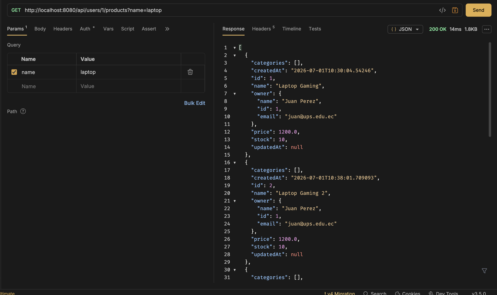

### Filtro por rango de precio — `GET /api/users/1/products?minPrice=500&maxPrice=1500`


### Productos por categoría — `GET /api/categories/1/products`
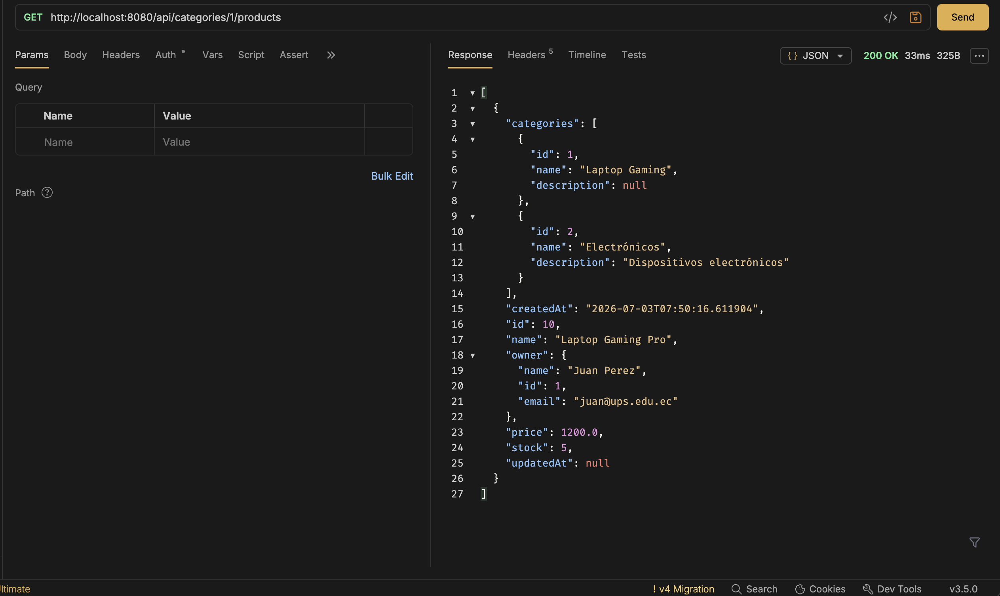

### Productos por categoría + usuario — `GET /api/categories/1/products?userId=1`


## 22. Manejo global de excepciones

Se creó una jerarquía de excepciones de dominio y un `@RestControllerAdvice` centralizado que traduce cualquier error en una respuesta JSON consistente:

| Clase | Uso |
|---|---|
| `AplicationException` | Excepción base con un `HttpStatus` asociado |
| `BadRequestException` | Datos de entrada semánticamente inválidos (400) |
| `NotFoundException` | Recurso no encontrado (404) |
| `ConflictException` | Conflicto de datos, p. ej. nombre duplicado (409) |
| `GlobalExceptionHandler` | Captura todas las excepciones y arma un `ErrorResponse` uniforme |

### Rango de precio inválido (`minPrice > maxPrice`) — `400 Bad Request`
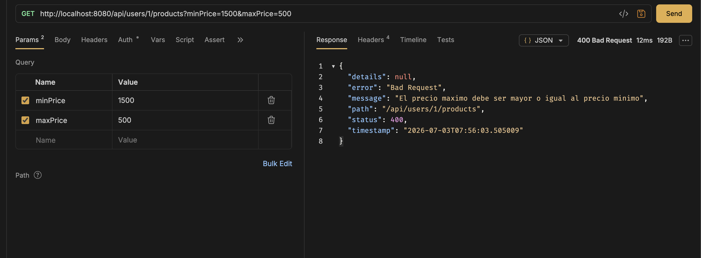

```json
{
  "status": 400,
  "error": "Bad Request",
  "message": "El precio maximo debe ser mayor o igual al precio minimo",
  "path": "/api/users/1/products"
}
```

---

# Práctica 10 – Paginación con `Page` y `Slice`

## 23. `PaginationDto`

```java
public class PaginationDto {
    @Min(value = 0, message = "La pagina debe ser mayor o igual a 0")
    private int page = 0;

    @Min(value = 1, message = "El tamano debe ser mayor o igual a 1")
    @Max(value = 100, message = "El tamano no debe superar 100 registros")
    private int size = 10;

    private String sortBy = "id";
    private String direction = "asc";
}
```

| Tipo | Diferencia |
|---|---|
| `Page<T>` | Incluye el total de elementos y de páginas (ejecuta un `COUNT` adicional) |
| `Slice<T>` | Solo indica si existe una página siguiente (`hasNext`), más liviano al no contar el total |

Nuevos endpoints: `GET /api/products/page`, `GET /api/products/slice` y sus equivalentes anidados en categoría, `GET /api/categories/{id}/products/page` y `/slice`.

### Paginación de productos — `GET /api/products/page?page=0&size=5`
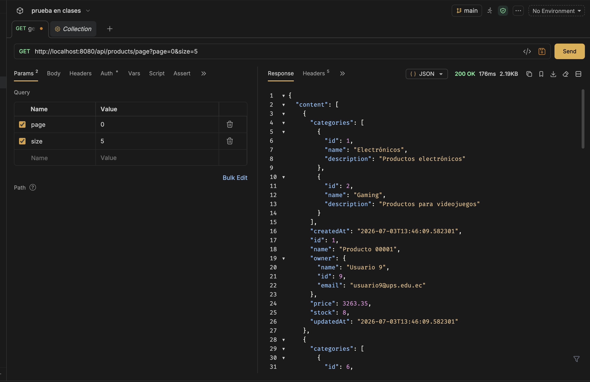

### Slice ordenado por precio descendente — `GET /api/products/slice?page=0&size=5&sortBy=price&direction=desc`
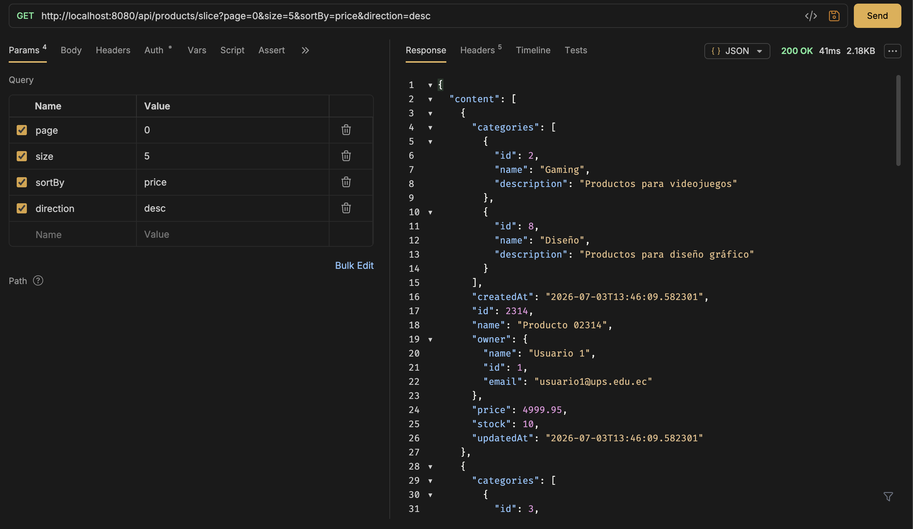

### Validación de parámetros inválidos — `GET /api/products/page?page=-1&size=0`
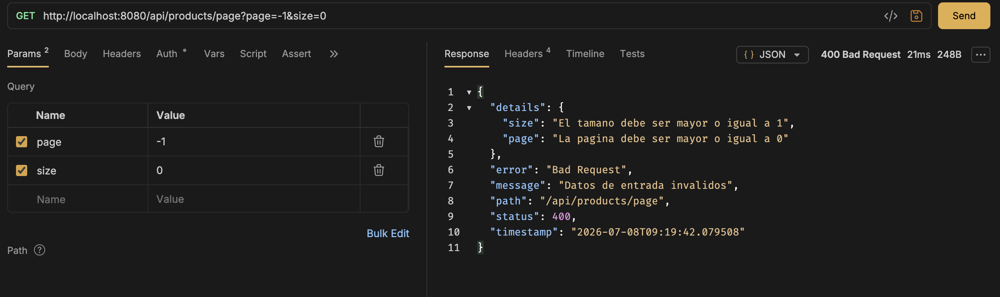

`400 Bad Request` — `PaginationDto` rechaza página negativa y tamaño menor a 1 antes de tocar la base de datos.

### Paginación combinada con filtro de categoría — `GET /api/categories/2/products/page?page=0&size=5`
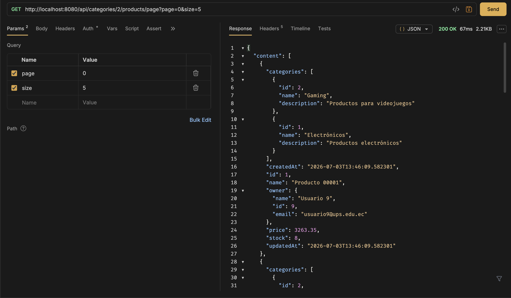

---

# Práctica 11-12 – Seguridad con JWT

## 24. Autenticación stateless

Se incorporó Spring Security + JJWT para proteger la API con tokens **JWT**, sin sesiones en el servidor (`SessionCreationPolicy.STATELESS`):

| Clase | Responsabilidad |
|---|---|
| `AuthController` | Expone `POST /auth/register` y `POST /auth/login` |
| `AuthService` | Registra usuarios (password con `BCryptPasswordEncoder`) y autentica |
| `JwtUtil` | Genera y valida tokens firmados con HS256, incluye `email`, `name` y `roles` como claims |
| `JwtAuthenticationFilter` | Intercepta cada petición, valida el header `Authorization: Bearer <token>` |
| `JwtAuthenticationEntryPoint` | Responde `401` cuando falta o es inválido el token |
| `SecurityConfig` | Define qué rutas son públicas (`/auth/**`, `/status/**`, `/actuator/**`) y cuáles requieren autenticación |
| `RoleEntity` / `RoleName` | Roles `ROLE_USER` / `ROLE_ADMIN` |

### Registro de usuario — `POST /api/auth/register`
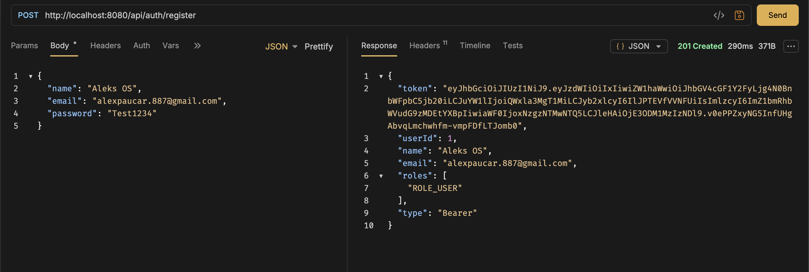

### Login — `POST /api/auth/login`
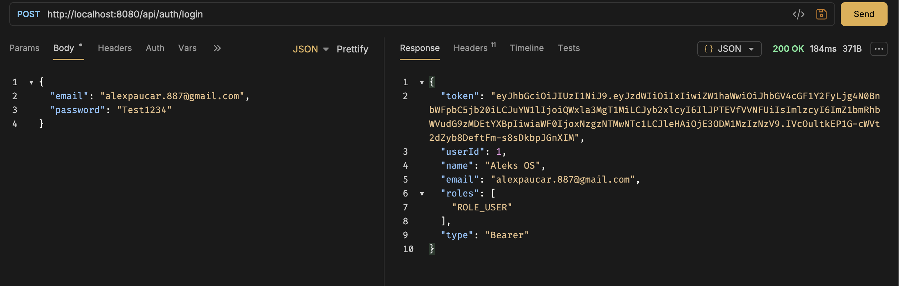

Ambos devuelven un token `Bearer` junto con los datos del usuario y sus roles.

### Petición sin token — `401 Unauthorized`
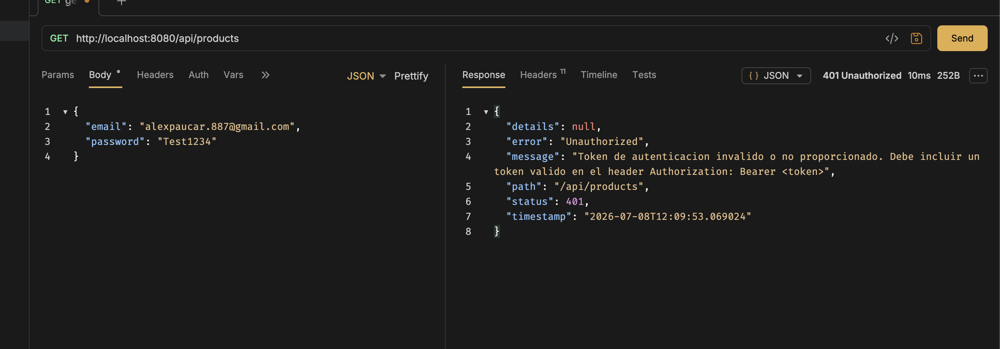

### Petición con token válido — `200 OK`
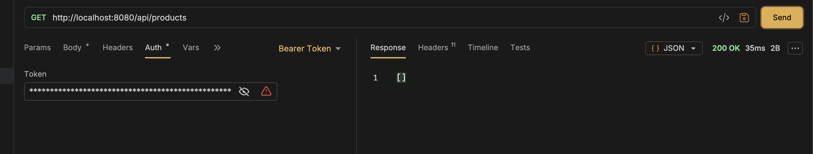

---

# Práctica 13 – Autorización por propietario y excepciones avanzadas

## 25. Ownership: solo el dueño (o un admin) puede modificar

`ProductController` ahora recibe el usuario autenticado con `@AuthenticationPrincipal UserDetailsImpl currentUser` en cada operación de escritura, y `ProductServiceImpl` valida la propiedad del recurso antes de actualizar, actualizar parcialmente o eliminar:

```java
private void validateOwnership(ProductEntity product, UserDetailsImpl currentUser) {
    if (currentUser == null)
        throw new AccessDeniedException("Usuario no autenticado");
    if (hasRole(currentUser, "ROLE_ADMIN"))
        return;
    if (product.getOwner().getId().equals(currentUser.getId()) == false)
        throw new AccessDeniedException("No puedes modificar productos ajenos");
}
```

Un `ROLE_ADMIN` puede operar sobre cualquier producto; un `ROLE_USER` solo sobre los suyos.

## 26. `GlobalExceptionHandler` ampliado

Se agregaron manejadores específicos para los errores que introduce la seguridad:

| Excepción | Status | Cuándo ocurre |
|---|---|---|
| `AccessDeniedException` | 403 | El usuario autenticado intenta modificar un producto ajeno |
| `AuthorizationDeniedException` | 403 | Un `@PreAuthorize` evalúa a `false` (p. ej. `ROLE_USER` accediendo a un endpoint de `ROLE_ADMIN`) |
| `AuthenticationException` | 401 | Respaldo para fallos de autenticación no capturados por `JwtAuthenticationEntryPoint` |

Con esto, todos los caminos de error de la API —validación de campos, reglas de negocio, autenticación y autorización— terminan devolviendo el mismo formato de `ErrorResponse`, sin importar en qué capa se originó el problema.

---

# Conclusión general

A lo largo de las 13 prácticas la API evolucionó de un `StudentController` con una lista en memoria a un backend con persistencia en PostgreSQL, relaciones `@ManyToOne`/`@ManyToMany`, filtros dinámicos, paginación, manejo centralizado de errores y autenticación/autorización con JWT. Cada práctica se apoyó en la anterior sin reescribir lo ya construido: las validaciones de la Práctica 6 siguen vigentes bajo seguridad, las relaciones de la Práctica 8 se ampliaron en la 9 sin romper los endpoints existentes, y la paginación y los filtros conviven con el control de acceso por propietario de la Práctica 13. El resultado es una API en capas (Controller → Service → Repository → Entity) donde cada capa tiene una responsabilidad única y donde los errores, de cualquier origen, siempre se comunican al cliente de forma consistente.